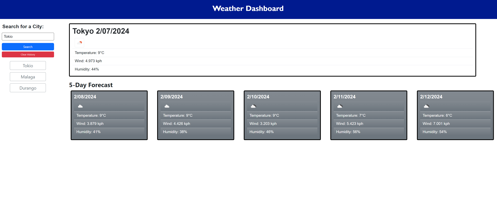

# Server-Side-APIs-Weather-Dashboard
Dynamic Weather Dashboard

This project was created to present a website, in wich the user can search for the actual weather of a city of the world;
this includes also the weather for the next 5 days.

This is done to help people that travel often, so that they can manage them selfs, preapare with proper clothing and see the weather previously.
The final result was achieved by using 2 APIS:
    -The "Current Weather Data".
    -The "5 Day Forecast".

To use this application, the user need only to go to the provided URL:" https://bryangc96.github.io/-06-Server-Side-APIs-Weather-Dashboard/ " , 
and write the name of a City in the input, then press the "Search" button.

The user can then navigate through past searches by clicking on the name in the generated list; and can easily delete the search history by clicking the red "clear history" button.

Example of the project: 

Done by:
-https://github.com/BryanGC96 
